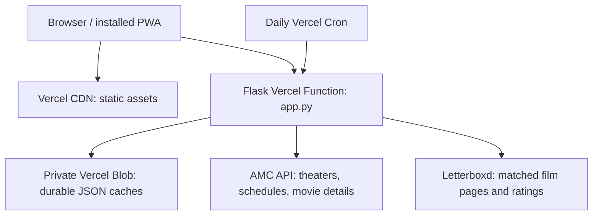

# Showtimes

A small movie-planning PWA: AMC showtimes for the next seven days, movie posters and details, and Letterboxd ratings. Filter by theater, day, and time, then compare what fits your week.

**Live:** [showtimes-one.vercel.app](https://showtimes-one.vercel.app/) · Vercel Hobby

The initial theaters are **AMC NewPark 12** and **AMC Mercado 20**. Open **Settings** at the top right to change the shared list of up to 10 theaters included in daily refreshes. **Anyone can edit this list; there is no account or owner password.** Saving replaces the list for everyone. An empty list stops scheduled showtime fetching.

The main **Theaters:** row is a personal display filter: **×** hides a theater and **+** restores it. These actions do not change the shared refresh list or trigger upstream fetches. Theater visibility, day/time preferences, and collapsed movies stay in your browser. Weekdays default to 4–9 PM; weekends show the full day.

## Architecture



Vercel runs `app.py`, not the legacy `server.py` web server. `server.py` is imported for shared parsing helpers with its background refresh thread disabled. No Google Cloud service is required by the Vercel app. `build.py` copies static files to `public/` for CDN delivery. The Flask function has a 300-second maximum duration; individual upstream operations use shorter budgets.

### Loading and refreshing

1. Opening the site reads saved schedules immediately.
2. Missing or stale schedules load through `POST /api/theater-week`: one request per theater, a shared 35-second upstream budget, and one saved snapshot containing all seven dates. Successful dates are committed together; failed dates retain their previous data. Fetching remains sequential to respect upstream services.
3. `POST /api/metadata` fills posters, synopsis, director/cast, and Letterboxd ratings in batches of up to four known movies, also with a 35-second upstream budget. The browser updates movie cards and rating order as batches finish. Metadata persists across cold starts, so it does not depend on waiting for cron. The schedule response identifies theaters with stale/missing metadata; a fully warm page skips these batch requests entirely.
4. A daily cron at **12:00 UTC** refreshes only the current shared theaters. Hobby cron timing has a one-hour window. It prioritizes schedules, with optional metadata enrichment afterward.
5. The Refresh button may request an early schedule refresh, but a five-minute minimum age and one immutable claim per theater limits duplicate upstream work.

Posters and credits come from AMC movie records. Letterboxd film matching uses the title plus release year and director to avoid confusing same-named films. Some films/events legitimately have no rating. Letterboxd scraping is unofficial and can fail independently of schedules or posters.

**Seat availability is a cached snapshot**, based on AMC's open/almost-full/sold-out flags—not live seat counts. The UI labels it as potentially changed. The legacy `/api/fills` polling service is not part of the Vercel deployment.

### Durable records

| Record | Purpose / retention |
| --- | --- |
| `favorites.json` | Shared refresh list; independent of schedule refreshes |
| `catalog.json` | AMC theater directory, seven-day cache |
| `schedules/{theater}.json` | One rolling seven-date snapshot per theater; each date has its own 24-hour freshness timestamp |
| `metadata/{theater}.json` | On-demand movie details and ratings; seven-day freshness |
| `metadata.json` | Metadata populated by cron, reused by on-demand batches |
| `claims/{time-slot}/…` | Immutable claims to suppress duplicate fetches; small records accumulate |

Existing `schedules/{theater}/{weekday}.json` files remain readable until the first refresh migrates that theater. They are not deleted during rollout. Old installed clients can still call `/api/theater-day`; it uses the same weekly writer and returns the requested date.

Schedule/metadata reads are memoized within each request where needed and may use Blob’s 60-second CDN cache. Refreshes read uncached snapshots, return newly saved data directly, and preserve per-date freshness. Shared settings bypass the cache. A different visitor can see the previous schedule/metadata for up to 60 seconds.

Claims provide throttling, not a transactional distributed lock: a time-slot boundary can permit overlap. Shared theater edits use last-save-wins behavior. The private Blob token is server-only; visitors use validated app endpoints, not direct storage access.

## Deploy on Vercel for free

1. Import this repository with the Vercel-ready code into a **Hobby** project. Use the Flask framework and repository root. `pyproject.toml` sets the `app:app` entrypoint; `vercel.json` sets the build, function duration, and cron. Keep Fluid Compute enabled.
2. Connect a **private Vercel Blob** store and enable its read-write token environment variable. Production needs `BLOB_READ_WRITE_TOKEN`. Use separate storage for previews that should not modify live theater settings.
3. Add the following **server-only** environment variables in Vercel:

   | Variable | Required | Purpose |
   | --- | --- | --- |
   | `AMC_VENDOR_KEY` | Yes | Existing AMC vendor API key |
   | `BLOB_READ_WRITE_TOKEN` | Yes | Created by the connected private Blob store |
   | `CRON_SECRET` | Yes for daily refresh | Random secret of at least 32 characters; Vercel sends it as a Bearer token |
   | `AMC_TIMEZONE` | No | Defaults to `America/Los_Angeles` |
   | `INITIAL_FAVORITE_NAMES` | No | JSON array of exact AMC names; defaults to NewPark/Mercado; only used before the first saved list |

   `OWNER_ACCESS_KEY` is **not used**. Editing the shared theater list is intentionally public. Never commit API keys or put them in frontend code.

4. Deploy or redeploy after environment changes. Check `/api/health`, open the site, wait for the first schedules and metadata batches, then reload to verify cached results.
5. In Project Settings → Cron Jobs, use **Run** to check the protected daily job. Do not expose `CRON_SECRET` in a URL or the frontend.
6. For automatic deployments, connect the repository under Vercel Project Settings → Git. Pushes to the configured production branch deploy automatically; other branches can create previews. Merely opening a GitHub PR does not connect an existing Vercel project.

The current project is connected to **DrakeLin/amc-showtimes**, with **main** as its production branch. The first deployment used a folder upload; subsequent changes deploy from GitHub.

### How GitHub changes reach the live site

1. Push a commit to a feature branch and open a pull request. Vercel can build a separate preview URL for checking that version.
2. Merge into `main` (or push directly to `main`). Vercel's GitHub integration detects the commit and starts a production build.
3. Vercel installs the Python dependencies, runs `python build.py` to copy the static assets, and packages `app.py` as a Flask function.
4. After a successful production deployment, `showtimes-one.vercel.app` serves the new version. A failed build leaves the previous deployment serving traffic. Build logs and the source commit are visible under the project's **Deployments** tab.

This uses [Vercel's Git integration](https://vercel.com/docs/git); a separate GitHub Actions deployment workflow is unnecessary. Local edits only reach Vercel after they are committed and pushed. README-only commits can also trigger a build.

API keys are supplied from Vercel environment settings. Blob records live outside the deployment, so releasing code does not reset saved theaters or caches. Production and preview environment variables are configured separately; use a separate preview Blob store to prevent test settings from changing the live refresh list.

### Free-tier scope

This is designed for personal-scale use on **Hobby**, with the included `vercel.app` domain and private Blob allowance. No paid database, paid domain, or plan upgrade is needed. It is not unlimited hosting: functions, Blob reads/writes, storage, and transfer all have quotas. Public edits and refreshes consume the same allowances.

A full scheduled refresh uses **two writes per theater** (one claim + one weekly snapshot), rather than two per theater/date. Ten theaters × two writes × 30 days = **600 schedule/claim writes per month**, down from 4,200. Metadata, settings, directory refreshes, and manual refreshes are additional. At ten theaters, each additional full manual refresh costs up to 20 schedule/claim writes; frequent manual refreshes can still exhaust the allowance. The five-minute cooldown suppresses repeated successful refreshes but is not a monthly quota enforcer.

There is **one scheduled job per day**, regardless of the number of selected theaters. Combining storage writes does not reduce the AMC requests: ten theaters over seven dates still need up to 70 showtime fetches for a complete refresh.

| Selected theaters | Schedule/claim writes per complete daily run | Over 30 days | Over 31 days |
| --- | ---: | ---: | ---: |
| 2 | 4 | 120 | 124 |
| 5 | 10 | 300 | 310 |
| 10 | 20 | 600 | 620 |

These are implementation estimates for completed schedule refreshes, excluding other operations, rather than measured bills. At ten theaters, the 30-day schedule baseline uses 30% of the 2,000 advanced-operation allowance.

After migration, `/api/showtimes` reads **2N + 2 records** for N theaters: shared settings, global metadata, and one schedule + one metadata record per theater. A fully warm page adds one settings read and no metadata POSTs: **23 reads for ten theaters**, versus 183 previously. CDN cache hits reduce billed simple operations further. Initial migration, missing data, metadata batches, settings searches, and retries cost extra. An offline operation-count test checks the ten-theater baseline.

[Vercel Blob Hobby](https://vercel.com/docs/vercel-blob/usage-and-pricing) includes 2,000 advanced operations and 10,000 simple operations monthly. These are monthly allowances, not a ten-refreshes-per-day quota. Monitor Usage; this optimization provides headroom for personal use, not unlimited public traffic. Cron retains a 200-second overall schedule budget; unfinished theaters/dates load on demand.

Blob's Hobby allowance also includes 1 GB of storage and 10 GB of transfer. Exceeding its limits blocks Blob access instead of billing overages; Vercel documents a 30-day wait before access resumes. Check the project's Usage page for actual consumption, including metadata work and dashboard operations. The app does not enforce a monthly operation budget.

## Repository layout

```text
app.py              Vercel Flask routes and refresh orchestration
storage.py          Private Blob JSON adapter; optional local disk storage
amc.py              AMC and Letterboxd fetching, parsing, film matching
server.py           Legacy Cloud Run entrypoint and shared helpers
static/             HTML, CSS, JavaScript, PWA manifest and service worker
build.py            Copies static assets into the Vercel CDN output
vercel.json         Flask build, duration and daily cron
pyproject.toml      Python dependencies and Vercel entrypoint
Dockerfile          Legacy Cloud Run container
tests/              Offline backend tests
```

## Vercel API

| Endpoint | Method | Purpose |
| --- | --- | --- |
| `/api/health` | GET | Runtime and configuration presence, never secret values |
| `/api/theatres?q=…` | GET | Search the cached AMC directory |
| `/api/favorites` | GET / PUT | Read or replace shared theater IDs; public writes require JSON; maximum 10 |
| `/api/showtimes` | GET | Cached movies and schedules, plus missing/stale theater-date jobs |
| `/api/theater-week` | POST | Refresh stale dates for one theater, persist one weekly snapshot; optional throttled early refresh |
| `/api/theater-day` | POST | Compatibility route: uses the weekly refresh, returns one valid date |
| `/api/metadata` | POST | Populate cached movie details and ratings for known schedules at a theater |
| `/api/cron` | GET | Daily refresh; requires `Authorization: Bearer <CRON_SECRET>` |

## Local development and tests

```bash
python3 -m venv .venv
.venv/bin/pip install -r requirements.txt
export AMC_VENDOR_KEY='<your AMC key>'
LOCAL_DATA_DIR=.local-data .venv/bin/flask --app app run --debug
.venv/bin/python -m unittest discover -s tests -v
node --check static/app.js
node --check static/favorites.js
node tests/test_favorites.cjs
```

`LOCAL_DATA_DIR` is ignored on Vercel; ephemeral disk must never silently replace durable storage. The Python `vercel` SDK is pinned to `0.11.3`; its synchronous Blob API uses `overwrite` and `result.content`.

The service worker caches the app shell. Bump its cache version in `static/sw.js` for frontend changes. API requests always use the network. Installed PWAs may need a reload after the updated worker activates.

## Troubleshooting

| Symptom | Check |
| --- | --- |
| No schedules | `/api/health`, valid AMC key, Blob connection, runtime logs |
| Posters or ratings missing | Metadata batch requests and runtime logs; a failed lookup must not remove a successful schedule |
| A few ratings remain N/A | Film matching, an unrated event, or unavailable Letterboxd page |
| Recent refresh does nothing | Five-minute refresh cooldown / duplicate request claim |
| Changes appear on another device | Expected for shared settings; main-screen filters remain local |
| Old UI after deployment | Reload after the new service worker activates |

## Legacy Cloud Run deployment

The previous [Cloud Run site](https://amc-showtimes-114648525819.us-west1.run.app/) uses `server.py`, GCS snapshots, and Cloud Scheduler. Its original Metreon/Kabuki defaults and live seat-status polling are separate from the Vercel deployment. Existing Google services have not been deleted. Legacy deployment details remain in [CLAUDE.md](CLAUDE.md); use this README for the current Vercel architecture.

## License

[MIT](LICENSE)

### Calendar integration runtime

`GET /api/movie-runtime/<AMC movie ID>` returns `{ok, runtime}` with runtime in minutes (or null when unavailable). It only accepts movies already present in saved metadata, performs one bounded AMC detail lookup on demand, and caches the result for seven days. A five-minute claim prevents repeated concurrent lookups. Homebase uses this when confirming a showtime; no Letterboxd profile scraping is involved. `/api/showtimes` also includes runtime when available in its metadata.
