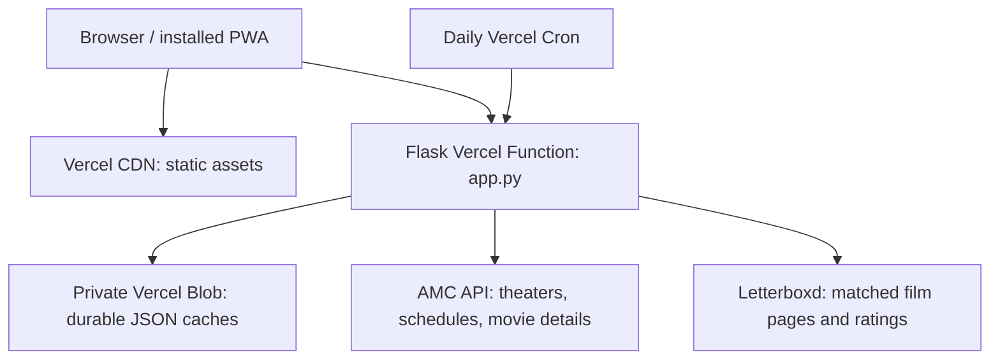

# Showtimes

A small movie-planning PWA: AMC showtimes for the next seven days, movie posters and details, and Letterboxd ratings. Filter by theater, day, and time, then compare what fits your week.

**Live:** [showtimes-one.vercel.app](https://showtimes-one.vercel.app/) · Vercel Hobby

The initial theaters are **AMC NewPark 12** and **AMC Mercado 20**. Open **Settings** at the top right to change the shared list of up to three theaters included in daily refreshes. **Anyone can edit this list; there is no account or owner password.** Saving replaces the list for everyone. An empty list stops scheduled showtime fetching.

The main **Theaters:** row is a personal display filter: **×** hides a theater and **+** restores it. These actions do not change the shared refresh list or trigger upstream fetches. Theater visibility, day/time preferences, and collapsed movies stay in your browser. Weekdays default to 4–9 PM; weekends show the full day.

## Architecture



Vercel runs `app.py`, not the legacy `server.py` web server. `server.py` is imported for shared parsing helpers with its background refresh thread disabled. No Google Cloud service is required by the Vercel app. `build.py` copies static files to `public/` for CDN delivery. The Flask function has a 300-second maximum duration; individual upstream operations use shorter budgets.

### Loading and refreshing

1. Opening the site reads saved schedules immediately.
2. Missing or stale dates load progressively through `POST /api/theater-day`, with a 35-second upstream deadline per theater/date. Successful dates are saved immediately; failures preserve old snapshots.
3. `POST /api/metadata` fills posters, synopsis, director/cast, and Letterboxd ratings in batches of up to four known movies, also with a 35-second upstream budget. The browser updates movie cards and rating order as batches finish. Metadata persists across cold starts, so it does not depend on waiting for cron.
4. A daily cron at **12:00 UTC** refreshes only the current shared theaters. Hobby cron timing has a one-hour window. It prioritizes schedules, with optional metadata enrichment afterward.
5. The Refresh button may request an early schedule refresh, but a five-minute minimum age and immutable request claims limit duplicate upstream work.

Posters and credits come from AMC movie records. Letterboxd film matching uses the title plus release year and director to avoid confusing same-named films. Some films/events legitimately have no rating. Letterboxd scraping is unofficial and can fail independently of schedules or posters.

**Seat availability is a cached snapshot**, based on AMC's open/almost-full/sold-out flags—not live seat counts. The UI labels it as potentially changed. The legacy `/api/fills` polling service is not part of the Vercel deployment.

### Durable records

| Record | Purpose / retention |
| --- | --- |
| `favorites.json` | Shared refresh list; independent of schedule refreshes |
| `catalog.json` | AMC theater directory, seven-day cache |
| `schedules/{theater}/{weekday}.json` | Seven reusable schedule slots per theater; actual date checked; 24-hour freshness |
| `metadata/{theater}.json` | On-demand movie details and ratings; seven-day freshness |
| `metadata.json` | Metadata populated by cron, reused by on-demand batches |
| `claims/{time-slot}/…` | Immutable claims to suppress duplicate fetches; small records accumulate |

Claims provide throttling, not a transactional distributed lock: a time-slot boundary can permit overlap. Shared theater edits use last-save-wins behavior. The private Blob token is server-only; visitors use validated app endpoints, not direct storage access.

## Deploy on Vercel for free

1. Import this repository with the Vercel-ready code into a **Hobby** project. Use the Flask framework and repository root. `pyproject.toml` sets the `app:app` entrypoint; `vercel.json` sets the build, function duration, and cron. Keep Fluid Compute enabled.
2. Connect a **private Vercel Blob** store and enable its read-write token environment variable. Production needs `BLOB_READ_WRITE_TOKEN`. Use separate storage for previews that should not modify live theater settings.
3. Add the following **server-only** environment variables in Vercel:

   | Variable | Required | Purpose |
   | --- | --- | --- |
   | `AMC_VENDOR_KEY` | Yes | Existing AMC vendor API key |
   | `BLOB_READ_WRITE_TOKEN` | Yes | Created by the connected private Blob store |
   | `CRON_SECRET` | Yes for daily refresh | Random secret of at least 32 characters; Vercel sends it as a Bearer token |
   | `AMC_TIMEZONE` | No | Defaults to `America/Los_Angeles` |
   | `INITIAL_FAVORITE_NAMES` | No | JSON array of exact AMC names; defaults to NewPark/Mercado; only used before the first saved list |

   `OWNER_ACCESS_KEY` is **not used**. Editing the shared theater list is intentionally public. Never commit API keys or put them in frontend code.

4. Deploy or redeploy after environment changes. Check `/api/health`, open the site, wait for the first schedules and metadata batches, then reload to verify cached results.
5. In Project Settings → Cron Jobs, use **Run** to check the protected daily job. Do not expose `CRON_SECRET` in a URL or the frontend.
6. For automatic deployments, connect the repository under Vercel Project Settings → Git. Pushes to the configured production branch deploy automatically; other branches can create previews. Merely opening a GitHub PR does not connect an existing Vercel project.

The current project was initially deployed through Vercel's folder upload. Code is maintained on GitHub; check the project's Git settings to confirm whether automatic deployment is connected.

### Free-tier scope

This is designed for personal-scale use on **Hobby**, with the included `vercel.app` domain and private Blob allowance. No paid database, paid domain, or plan upgrade is needed. It is not unlimited hosting: functions, Blob reads/writes, storage, and transfer all have quotas. Public edits and refreshes consume the same allowances.

Two theaters × seven dates × 30 days is roughly 420 schedule writes and 420 claim writes per month, plus metadata, settings, and any early refreshes. Three theaters raise that baseline to roughly 1,260 writes before metadata. Monitor Vercel Usage, especially Blob operation quotas. Daily cron, the three-theater cap, bounded requests, and cached metadata keep routine use small.

## Repository layout

```text
app.py              Vercel Flask routes and refresh orchestration
storage.py          Private Blob JSON adapter; optional local disk storage
amc.py              AMC and Letterboxd fetching, parsing, film matching
server.py           Legacy Cloud Run entrypoint and shared helpers
static/             HTML, CSS, JavaScript, PWA manifest and service worker
build.py            Copies static assets into the Vercel CDN output
vercel.json         Flask build, duration and daily cron
pyproject.toml      Python dependencies and Vercel entrypoint
Dockerfile          Legacy Cloud Run container
tests/              Offline backend tests
```

## Vercel API

| Endpoint | Method | Purpose |
| --- | --- | --- |
| `/api/health` | GET | Runtime and configuration presence, never secret values |
| `/api/theatres?q=…` | GET | Search the cached AMC directory |
| `/api/favorites` | GET / PUT | Read or replace shared theater IDs; public writes require JSON; maximum three |
| `/api/showtimes` | GET | Cached movies and schedules, plus missing/stale theater-date jobs |
| `/api/theater-day` | POST | Fetch one valid theater/date; optional throttled refresh |
| `/api/metadata` | POST | Populate cached movie details and ratings for known schedules at a theater |
| `/api/cron` | GET | Daily refresh; requires `Authorization: Bearer <CRON_SECRET>` |

## Local development and tests

```bash
python3 -m venv .venv
.venv/bin/pip install -r requirements.txt
export AMC_VENDOR_KEY='<your AMC key>'
LOCAL_DATA_DIR=.local-data .venv/bin/flask --app app run --debug
.venv/bin/python -m unittest discover -s tests -v
node --check static/app.js
node --check static/favorites.js
```

`LOCAL_DATA_DIR` is ignored on Vercel; ephemeral disk must never silently replace durable storage. The Python `vercel` SDK is pinned to `0.11.3`; its synchronous Blob API uses `overwrite` and `result.content`.

The service worker caches the app shell. Bump its cache version in `static/sw.js` for frontend changes. API requests always use the network. Installed PWAs may need a reload after the updated worker activates.

## Troubleshooting

| Symptom | Check |
| --- | --- |
| No schedules | `/api/health`, valid AMC key, Blob connection, runtime logs |
| Posters or ratings missing | Metadata batch requests and runtime logs; a failed lookup must not remove a successful schedule |
| A few ratings remain N/A | Film matching, an unrated event, or unavailable Letterboxd page |
| Recent refresh does nothing | Five-minute refresh cooldown / duplicate request claim |
| Changes appear on another device | Expected for shared settings; main-screen filters remain local |
| Old UI after deployment | Reload after the new service worker activates |

## Legacy Cloud Run deployment

The previous [Cloud Run site](https://amc-showtimes-114648525819.us-west1.run.app/) uses `server.py`, GCS snapshots, and Cloud Scheduler. Its original Metreon/Kabuki defaults and live seat-status polling are separate from the Vercel deployment. Existing Google services have not been deleted. Legacy deployment details remain in [CLAUDE.md](CLAUDE.md); use this README for the current Vercel architecture.

## License

[MIT](LICENSE)
